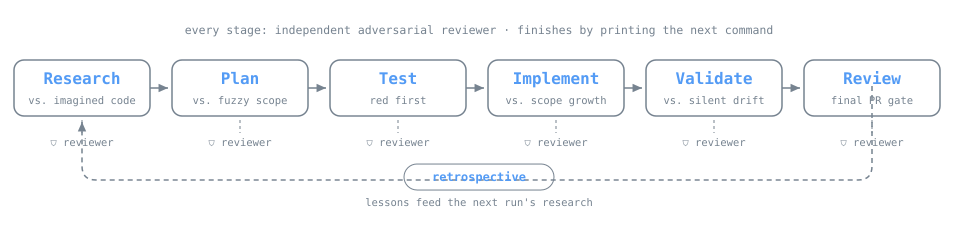

# Agentic SDLC Toolkit

A toolkit of Claude Code skills that brings engineering discipline to AI-assisted development, **research → plan → test → implement → validate → review**: topped with a cron-driven orchestration layer that can carry the whole pipeline through without a human touching it.



Nothing in this repo is a mock-up. The files in [`skills/`](skills/) are the real slash commands this workflow was built and refined with, scrubbed of project specifics so they drop into any codebase.

## The case for staged work

The default mode of AI-assisted coding is one big prompt per task: say what you want, receive code, merge. It holds up right until it doesn't, the change balloons beyond the original ask, tests arrive after the code they were meant to constrain (when they arrive at all), and nothing independent stands between the work and the merge button.

Here, the work is split into deliberate stages, and each stage exists to block one specific, recurring failure of AI-assisted development:

- **Research** blocks the failure where a plan is drawn against a codebase the model imagined rather than the one on disk.
- **Plan** blocks building the wrong thing. Each phase carries an explicit scope, an equally explicit *out-of-scope* list, and **behavioral contracts** sharp enough that failing tests can be written from them alone, no peeking at implementation.
- **Test**: authored from the contracts, ahead of any implementation, blocks the failure where the code gets to decide what counts as correct.
- **Implement** blocks quiet scope growth: the smallest code that turns the pre-written tests green, one phase at a time. Anything no test demands stays unbuilt.
- **Validate** blocks unannounced drift, by walking the diff against the plan phase by phase and contract by contract.
- **Review** blocks debt, security holes, and performance regressions from riding along, the final gate ahead of a PR.

Two structural rules hold the loop together:

1. **Each stage spawns its own independent reviewer agent**, and the reviewer's prompt is adversarial by design (the test reviewer, for instance, has to invent a *defective implementation the tests would still accept*, success there means the tests are too soft). The author never signs off on its own output.
2. **Each stage finishes by printing the precise command that comes next**, which keeps the loop self-propelling while making every hand-off an explicit checkpoint.

## Installation

Drop the skill files into your Claude Code commands directory:

```bash
cp skills/*.md ~/.claude/commands/        # user-level (all projects)
# or
cp skills/*.md .claude/commands/          # project-level (one repo)
```

Each file turns into a slash command carrying the file's name (so `research_codebase.md` becomes `/research_codebase`).

**What the skills expect your project to already have:**
- A `CLAUDE.md` at the repo root that states your non-negotiable rules, architecture invariants, security constraints, the commands that verify a change. Every skill opens with it: the loop is a rule *enforcer*, and the rules are yours to supply.
- A `thoughts/` directory (materializes on first use) holding every artifact the loop produces: `thoughts/shared/research/`, `plans/`, `reviews/`, `retrospectives/`, `autopilot/`, `coding/`.
- Verification commands, lint, type check, tests. The skills ship with a Python + Node example suite; swap those blocks for whatever your CI actually runs.
- For the **cron-driven pipeline only**: a Claude Code environment exposing durable cron tools (`CronCreate` / `CronDelete`, available in Claude Code's scheduled-agents feature). The manual core loop and `/autopilot` need nothing beyond stock Claude Code.

## The core loop

```
/prior_art  ──►  /research_codebase  ──►  /create_plan  ──►  /test_implementation
 (optional)         (research doc)         (phased plan        (red phase: failing
                                            + contracts)        tests from contracts)
                                                                      │
        /retrospective  ◄──  /review_implementation  ◄──  /validate_plan  ◄──  /implement_plan
         (lessons →           (final PR gate:              (plan vs. reality     (green + refactor,
          memory)              debt/security/perf)          audit)                one phase at a time)
```

| Skill | Stage | Failure it blocks |
|-------|-------|-------------------|
| [`skills/prior_art.md`](skills/prior_art.md) | Pre-research | Redoing research an earlier doc already settled; letting retrospective lessons evaporate |
| [`skills/research_codebase.md`](skills/research_codebase.md) | Research | Planning against a codebase the model imagined instead of the one on disk |
| [`skills/create_plan.md`](skills/create_plan.md) | Plan | Fuzzy scope; requirements nobody could write a test against |
| [`skills/test_implementation.md`](skills/test_implementation.md) | Test (red) | Letting the implementation set its own bar for correctness |
| [`skills/implement_plan.md`](skills/implement_plan.md) | Code (green) | Scope growth and gold-plating |
| [`skills/validate_plan.md`](skills/validate_plan.md) | Validate | Drift between what was planned and what got built, discovered by nobody |
| [`skills/review_implementation.md`](skills/review_implementation.md) | Review | Debt, security, and performance problems arriving at the PR unchallenged |
| [`skills/retrospective.md`](skills/retrospective.md) | Learn | Making the same mistake twice |

## Quickstart

To ship one feature in an existing codebase:

```
/prior_art <topic>                                      # optional: mine accumulated knowledge first
/research_codebase <topic>                              # produces a reviewed research doc
/create_plan <feature>, see <research-doc>             # produces a reviewed, phased plan with contracts
/test_implementation <plan-path>                        # red phase: failing tests from the contracts
/implement_plan <plan-path>                             # green phase, one phase at a time
/validate_plan <plan-path>                              # audit implementation against the plan
/review_implementation <plan-path>                      # final PR gate
/retrospective <plan-path>                              # extract lessons
```

The stages are deliberately separate commands. The temptation to fuse them back into a single mega-prompt is worth resisting, the seams between stages are exactly where the independent checkpoints live. Every command hands you the next one to run, verbatim.

## Autonomous orchestration

Once the manual loop is second nature, two layers take the human out of it:

### Single plan: `/autopilot`

[`skills/autopilot.md`](skills/autopilot.md) takes one approved plan and drives it through test → implement (every phase) → validate → review, giving each step a **fresh Claude context** inside an isolated **git worktree**, committing whenever a step lands, and merging automatically at the end. Under the hood it calls a small conductor script that lives in your repo (`scripts/autopilot.py`: a plain Python loop that shells out to `claude -p` once per step; deliberately not bundled here, because it's ~100 lines you should own and shape yourself).

Companion commands: [`skills/status.md`](skills/status.md) (dashboard), [`skills/catchup.md`](skills/catchup.md) (30-second session briefing), [`skills/abandon.md`](skills/abandon.md) (tear down a failed run's worktree and branch).

### Multi-feature spec: the cron-driven pipeline

When the unit of work is a whole feature set instead of one plan, the pipeline goes event-driven:

```
/pm-spec  ──►  /run-spec  ──►  [CronJob every 2 min]  ──►  /spec-conductor  ──►  /spec-status
 (engineering    (writes pipeline-status.json,              (resolves dependency      (monitor)
  handoff spec)   creates durable cron job)                  gates, spawns one
                                                             zero-context agent
                                                             per ready step)
```

- [`skills/pm-spec.md`](skills/pm-spec.md) distills finalized product documents into a spec engineering can act on directly: per-feature scope, its out-of-scope mirror, an ordered dependency chain, and research questions concrete enough to hand straight to Grep.
- [`skills/run-spec.md`](skills/run-spec.md) converts that spec into a `pipeline-status.json` tracker, one entry per feature, each carrying its own research → plan → tests → implement → validate → review pipeline plus **dependency gates** of the form `"F1": "plan_or_later"`: then registers a **durable cron job** that pings the conductor every 2 minutes.
- [`skills/spec-conductor.md`](skills/spec-conductor.md) is the engine. On every firing it fails out steps that have hung too long, opens any gate whose condition now holds, and launches **one fresh background agent per step that is ready**. Every agent begins with an empty context, reads nothing beyond its declared inputs, applies the matching core-loop skill as its method, writes its artifact, and records progress in the tracker. Agents never chain into the next step, only the cron heartbeat advances the pipeline. Once every feature reads `done` or `failed`, the conductor deletes its own cron job.
- [`skills/spec-status.md`](skills/spec-status.md) is the read-only dashboard, complete with exact resume steps for anything that failed.

One principle runs through the whole design: **state belongs in files, never in context.** A step can crash, stall, or get picked up later by an agent that has never seen the project, the tracker and the artifact docs together are the pipeline's entire memory.

## Adapting to your project

1. Write a `CLAUDE.md` worth enforcing, these skills police rules; without rules they have nothing to police.
2. Swap the sample verification blocks (ruff/pytest/tsc/vitest) for your actual CI commands in `create_plan.md`, `validate_plan.md`, and `implement_plan.md`.
3. Point `test_implementation.md` at wherever your tests actually live.
4. If you run the spec pipeline, note that the conductor's step prompts reference `~/.claude/commands/<skill>.md`: update those paths if you installed at the project level instead.

## Companion projects

Two real projects were built with this workflow, and both are public:

- [**SGO-Audit**](https://github.com/nktarasios/sgo-audit): a data-quality audit of automation-level labels in NHTSA's public SGO crash data (heuristics → LightGBM → local-LLM consensus queue).
- [**VRU-Detect**](https://github.com/nktarasios/vru-detect): a vulnerable-road-user detection benchmark on BDD100K, with stratified metrics and an explicit miss-cost threshold story.

Stage-by-stage case studies tracing one slice of each project through the full loop are in progress; the required format lives in [CONTRIBUTING.md](CONTRIBUTING.md). Until they land, [`case-studies/`](case-studies/) holds the stubs that define their scope.

## License

MIT, see [LICENSE](LICENSE).
